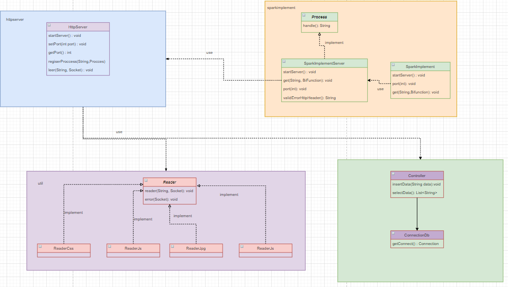

# Taller Cliente Y Servicios

## Autor: Juan Sebastian Ramos Isaza

## Fecha: 12/02/2021

### Despliegue Heroku

### Circleci

### Prerequisitos
Para el uso de esta aplicación se necesitan tener instalados los siguientes componentes:

* [Java 11 o superior](https://www.oracle.com/co/java/)
* [maven](https://maven.apache.org/)
* [git](https://git-scm.com/)

### Instalación 
1. Se debe clonar el proyecto en su máquina local con el comando:
* git clone
2. Abrir el proyecto con su Idle de confianza.
3. Para empezar a trabajar con este proyecto se recomienda mirar el ejemplo que esta
   presente en la clase DemoRuntime, para familiarizarse con sintaxis

### Uso
Para el uso de este Framework se deben tener en cuenta algunos aspectos importantes como son:
* Los archivos con extensiones .html - .js - .css - .jpg que se quieren usar se deben guardar
  en la extensión /src/main/resources/template
* la sintaxis que maneja el Framework para la implementación del método GET HTTP es:
  get(path,(req, resp)->nombreArchivo);
* El path indica la ruta que se quiere usar.
* la función anónima recibe dos parámetros y espera que el retorno sea el nombre del archivo que se quiere usar.  

### Arquitectura General

### Ejecucion
* Maquinas con distribuciones de linux:
>java -cp target/classes edu.escuelaing.arep.demo.DemoRuntime
* Maquina con windows
>java -cp target/classes edu.escuelaing.arep.demo.DemoRuntime

Después de ejecutar el comando en consola le aparecerá un mensaje indicando que está escuchando en el puerto 3478
para ver el funcionamiento pueden ingresar inicialmente https://127.0.0.1:3478 donde podrán observar que el servidor
está funcionando correctamente.

Para revisar las rutas de la demo debe ingresar a las siguientes URL:
* https://127.0.0.1:3478/Apps/hello
* https://127.0.0.1:3478/Apps/img

donde podrá observar un HTML implementado y una imagen respectivamente

Adicionalmente el las rutas:
* https://127.0.0.1:3478/Apps/index
* https://127.0.0.1:3478/Apps/valores
  
podran agregar a la bases de datos de prueba un nombre cualquiera y ver el resultados de la consulta 
respectivamente.
* la función anónima recibe dos parámetros y espera que el retorno sea el nombre del archivo que se quiere usar.
### Javadoc
La documentación se encuentra en el directorio apidocs, para generar una nueva documentación
pueden hacer uso del comando mvn javadoc:javadoc en su Shell esta se generará en el directorio target/site.

### Licencia

En este proyecto se usó la licencia GNU - se puede ver [LICENSE.txt](LICENSE.txt) para más detalles.
